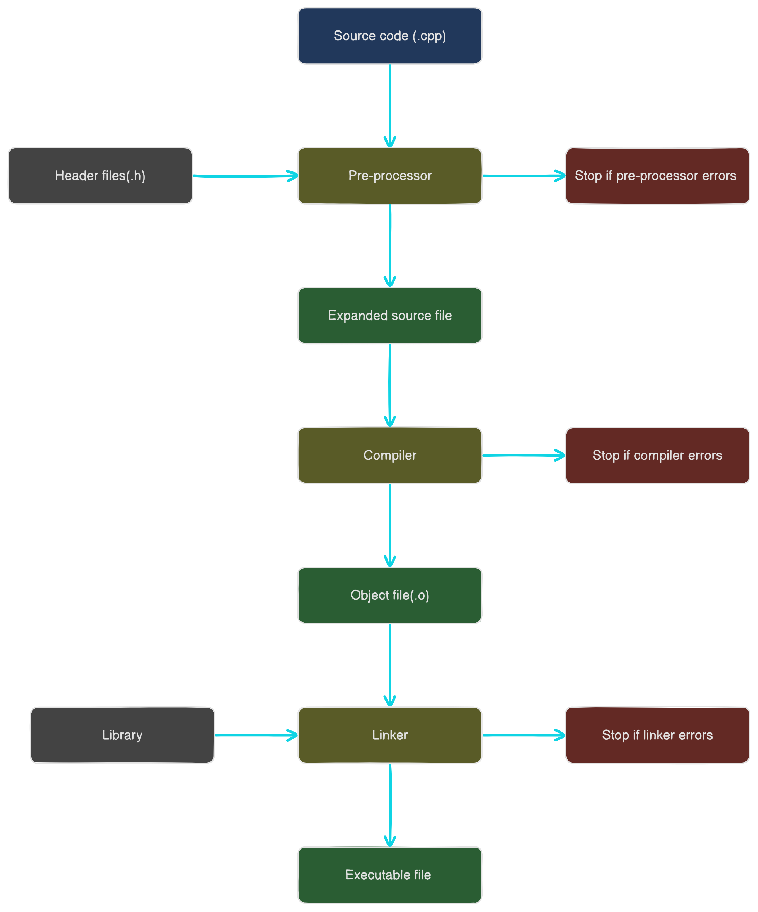

# C++ Learning and Practice Repository

Welcome to my **C++ Learning and Practice Repository**! This repository contains all my experiments, exercises, and projects as I explore the world of C++ programming. It is organized into various sections, each focusing on a specific concept or topic in C++.

---

## C++ Compiler Workflow Diagram

Below is a diagram that illustrates the workflow of a C++ compiler. It shows the steps involved in compiling and linking a C++ program, from preprocessing to generating the final executable.



--- txt

```
┌───────────────────────┐
│      main.cpp         │  ← Source code (.cpp, .hpp)
└──────────┬────────────┘
           │
           ▼
┌───────────────────────┐
│ [1] Preprocessing     │  ← Handles #include, #define, macros, #ifdef, etc.
│    (g++ -E → .i/.ii)  │  → Output: Preprocessed source (.i for C, .ii for C++)
└──────────┬────────────┘
           │
           ▼
┌───────────────────────┐
│ [2] Compilation       │  ← Converts C++ to assembly (with optimizations if -O2/-O3)
│    (g++ -S → .s)      │  → Output: Assembly code (.s)
└──────────┬────────────┘
           │
           ▼
┌───────────────────────┐
│ [3] Assembling        │  ← Converts assembly to machine code (binary)
│    (g++ -c → .o/.obj) │  → Output: Object file (.o for Unix, .obj for Windows)
└──────────┬────────────┘
           │
           ▼
┌───────────────────────┐
│ [4] Linking           │  ← Combines object files + static/dynamic libraries
│    (g++ *.o -o main)  │  → Output: Executable (a.out, main.exe, or custom name)
└──────────┬────────────┘
           │
           ▼
┌───────────────────────┐
│   Final Executable    │  ← ./main (ELF on Linux, PE on Windows, Mach-O on macOS)
└───────────────────────┘
```

## Repository Structure

### 📂 **Core Concepts**

- **Syntax and Basics**: Learn the fundamentals of C++ syntax and structure.
- **Variables and Data Types**: Explore different variable types and their usage.
- **Operators**: Understand arithmetic, logical, and bitwise operators.

### 📂 **Control Flow**

- **Loops**: Practice `for`, `while`, and `do-while` loops.
- **Conditionals**: Work with `if`, `else`, and `switch` statements.

### 📂 **Functions**

- **Function Basics**: Learn how to declare, define, and call functions.
- **Function Overloading**: Understand how to use multiple functions with the same name but different parameters.
- **Recursion**: Solve problems using recursive functions.

### 📂 **Object-Oriented Programming (OOP)**

- **Classes and Objects**: Learn how to create and use classes and objects.
- **Encapsulation, Inheritance, and Polymorphism**: Dive into the core principles of OOP.

### 📂 **Data Structures**

- **Arrays and Vectors**: Work with static and dynamic collections of data.
- **STL (Standard Template Library)**: Explore advanced data structures like lists, maps, and sets.

### 📂 **Competitive Programming**

- **Problem Solving**: Solve problems from platforms like Codeforces and LightOJ.
- **Optimization**: Learn techniques to write efficient and optimized code.

---

## Highlights

### 🛠️ **Custom Fish Shell Functions**

This repository includes custom Fish shell functions to streamline the compilation and execution of C++ programs. These functions:

- Automatically detect the file type (`.c` or `.cpp`).
- Compile the file using the appropriate compiler (`gcc` or `g++`).
- Measure and display compilation and execution times.

<details>
  <summary>Fish Shell Function 1 (Recommended)</summary>
  <pre>
    <code>
    function cv
        if test (count $argv) -eq 0
            echo "Usage: cv <file.c or file.cpp>"
            return 1
        end

        set file $argv[1]

        if not test -f $file
            echo "File not found!"
            return 1
        end

        # Extract file extension
        set extension (string split -r '.' $file)[2]

        if test -z "$extension"
            echo "Invalid file. Please provide a file with a .c or .cpp extension."
            return 1
        end

        set extension (string lower $extension)

        set output "output_executable"

        # Check if file is .c or .cpp
        if test $extension = "c"
            set compiler gcc
        else if test $extension = "cpp"
            set compiler g++
        else
            echo "Invalid file extension. Please provide a .c or .cpp file."
            return 1
        end

        # Compile the file and measure compile time
        echo "Compiling $file..."
        set compile_start (date +%s%N)
        $compiler $file -o $output
        set compile_end (date +%s%N)
        set compile_time (math (math $compile_end - $compile_start) / 1000000000)
        echo "Compile time: $compile_time seconds"

        # Check if the file was compiled successfully
        if not test -x $output
            echo "Compilation failed!"
            return 1
        end

        # Run the executable and measure execution time and memory usage
        echo "Executing $output..."
        set exec_start (date +%s%N)

        # Measure execution time using the built-in time command
        time ./$output

        set exec_end (date +%s%N)
        set exec_time (math (math $exec_end - $exec_start) / 1000000000)
        echo "Execution time: $exec_time seconds"

        # Remove the output executable
        rm $output
    end
    </code>

  </pre>
</details>

<details>
  <summary>Fish Shell Function 2</summary>
  <pre>
    <code>
    # Define variables for colors
    set -g __COLOR_RESET (set_color normal)
    set -g __COLOR_RED (set_color red)
    set -g __COLOR_GREEN (set_color green)
    set -g __COLOR_CYAN (set_color cyan)
    set -g __COLOR_MAGENTA (set_color magenta)

    function cr
        # Check if file exists
        if test -f $argv[1]
            # Auto detect compiler
            if type -q g++
                set compiler "g++"
            else
                echo "Error: Compiler not found"
                return 1
            end

            # Log starting time for compilation
            set start_compile_time (date +%s%N)

            # Compile the file
            echo -n "Compiling... "
            if $compiler $argv[1] -o output 2> log
                echo "$__COLOR_GREEN Successful"
                set success true
            else
                echo "$__COLOR_RED Error"
                cat log
                rm -f log
                return 1
            end

            # Log compilation time
            set end_compile_time (date +%s%N)
            set compile_time_ns (math $end_compile_time - $start_compile_time)
            set compile_time_ms (math $compile_time_ns / 1000000)
            set compile_time_s (math $compile_time_ms / 1000)
            echo -n $__COLOR_CYAN"Compilation Time: "
            if test $compile_time_s -gt 60
                echo "$compile_time_s seconds"
            else if test $compile_time_ms -gt 1000
                echo "$compile_time_s seconds"
            else
                echo "$compile_time_ms milliseconds"
            end

            # Add newline before execution log
            echo ""

            # Execute the binary
            echo -n $_COLOR_MAGENTA "Executing... "
            set start_time (date +%s%N)
            ./output
            set end_time (date +%s%N)
            set execution_time_ns (math $end_time - $start_time)
            set execution_time_ms (math $execution_time_ns / 1000000)
            set execution_time_s (math $execution_time_ms / 1000)

            # Log total execution time
            echo ""
            echo ""
            echo -n $__COLOR_CYAN"Total Execution Time: "
            if test $execution_time_s -gt 60
                echo "$execution_time_s seconds"
            else if test $execution_time_ms -gt 1000
                echo "$execution_time_s seconds"
            else
                echo "$execution_time_ms milliseconds"
            end

            # Cleanup
            rm -f output

            return 0
        else
            echo "Error: File not found"
            return 1
        end

        # Log total compilation time and execution time at the end with different color
        echo ""
        echo ""
        echo -n $__COLOR_MAGENTA"Total Compilation Time: "
        if test $compile_time_s -gt 60
            echo "$compile_time_s seconds"
        else if test $compile_time_ms -gt 1000
            echo "$compile_time_s seconds"
        else
            echo "$compile_time_ms milliseconds"
        end

        echo -n $__COLOR_MAGENTA"Total Execution Time: "
        if test $execution_time_s -gt 60
            echo "$execution_time_s seconds"
        else if test $execution_time_ms -gt 1000
            echo "$execution_time_s seconds"
        else
            echo "$execution_time_ms milliseconds"
        end
    end
    </code>

  </pre>
</details>

<details>
  <summary>Powershell function for input and output text file setup</summary>
  <pre>
    <code>
   function cv {
    param (
        [Parameter(Mandatory=$true)]
        [string]$file
    )

    # Compile the C++ file
    $exe = [System.IO.Path]::GetFileNameWithoutExtension($file)
    g++ $file -o $exe
    if ($LASTEXITCODE -ne 0) {
        Write-Host "Compilation failed." -ForegroundColor Red
        return
    }

    # Prepare input/output
    $inputFile = "input.txt"
    $outputFile = "output.txt"

    if (Test-Path $inputFile) {
        Start-Process -FilePath ".\$exe.exe" -RedirectStandardInput $inputFile -RedirectStandardOutput $outputFile -Wait
        Write-Host "Program executed with input.txt -> output.txt"
    } else {
        .\$exe.exe | Out-File $outputFile
        Write-Host "Program executed with no input -> output.txt"
    }

}
</code>

  </pre>
</details>

---

## How to Use This Repository

1. Clone the repository:
   ```bash
   git clone https://github.com/your-username/cpp-tutorial.git
   cd cpp-tutorial
   ```
