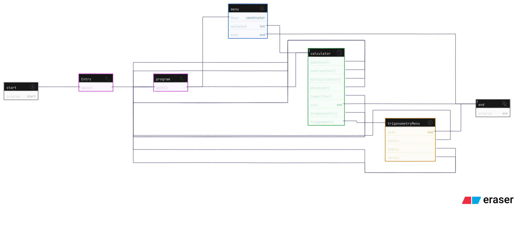

## [Task-01] Calculater programm

### Diagram



### Code

```cpp
#include <cmath>
#include <iomanip>
#include <iostream>
#include <vector>
using namespace std;

class Menu {
  public:
    int selected;
    Menu(vector<string>& options) {
        vector<string> opts = options;
        opts.push_back("Exit");
        while (true) {
            cout << "\n========= MENU =========\n";
            for (int i = 0; i < opts.size(); i++) {
                cout << "[" << i << "] : " << opts[i] << endl;
            }

            cout << "Select option (0-" << opts.size() - 1 << "): ";
            if (!(cin >> selected)) {
                cin.clear();
                cin.ignore(1000, '\n');
                cout << "Invalid input! Try again.\n";
                continue;
            }

            if (selected == opts.size() - 1) {
                cout << "Program stopped.\n";
                exit(0);
            }

            if (selected >= 0 && selected < opts.size() - 1) {
                break;
            } else {
                cout << "Invalid option! Try again.\n";
            }
        }
    }
};

class Calculator {
  public:
    void addition() {
        cout << "\n========= addition =========\n";
        double a, b;
        cout << "Enter a: ";
        cin >> a;
        cout << "Enter b: ";
        cin >> b;
        cout << "Result: " << a << " + " << b << " = " << a + b << endl;
    }

    void subtraction() {
        cout << "\n========= subtraction =========\n";
        double a, b;
        cout << "Enter a: ";
        cin >> a;
        cout << "Enter b: ";
        cin >> b;
        cout << "Result: " << a << " - " << b << " = " << a - b << endl;
    }

    void multiplication() {
        cout << "\n========= multiplication =========\n";
        double a, b;
        cout << "Enter a: ";
        cin >> a;
        cout << "Enter b: ";
        cin >> b;
        cout << "Result: " << a << " * " << b << " = " << a * b << endl;
    }

    void division() {
        cout << "\n========= division =========\n";
        double a, b;
        cout << "Enter a: ";
        cin >> a;
        cout << "Enter b: ";
        cin >> b;
        if (b == 0) {
            cout << "Error: Division by zero!\n";
        } else {
            cout << "Result: " << a << " / " << b << " = " << a / b << endl;
        }
    }

    void logarithm() {
        cout << "\n========= logarithm =========\n";
        double x;
        cout << "Enter a positive number: ";
        cin >> x;
        if (x <= 0) {
            cout << "Error: log undefined for non-positive numbers!\n";
        } else {
            cout << "Result: log(" << x << ") = " << log(x) << endl;
        }
    }

    void trigonometry() {
        cout << "\n========= trigonometry =========\n";
        vector<string> trigOpts = {"sin(x)", "cos(x)", "tan(x)", "Main menu"};
        Menu           m(trigOpts);

        double       x;
        const double PI = 3.141592653589793;
        cout << "Enter angle in degrees: ";
        cin >> x;
        double rad = x * PI / 180.0;

        switch (m.selected) {
        case 0:
            cout << "sin(" << x << ") = " << sin(rad) << endl;
            break;
        case 1:
            cout << "cos(" << x << ") = " << cos(rad) << endl;
            break;
        case 2:
            cout << "tan(" << x << ") = " << tan(rad) << endl;
            break;
        case 3:
            return;
        }
    }
};

void init() {
    Calculator     calc;
    vector<string> mainMenu = {"Addition", "Subtraction", "Multiplication", "Division", "Trigonometry", "Logarithm"};

    while (true) {
        Menu m(mainMenu);
        switch (m.selected) {
        case 0:
            calc.addition();
            break;
        case 1:
            calc.subtraction();
            break;
        case 2:
            calc.multiplication();
            break;
        case 3:
            calc.division();
            break;
        case 4:
            calc.trigonometry();
            break;
        case 5:
            calc.logarithm();
            break;
        }
    }
}

int main() {
    init();
    return 0;
}
```

### Output

```txt
========= MENU =========
[0] : Addition
[1] : Subtraction
[2] : Multiplication
[3] : Division
[4] : Trigonometry
[5] : Logarithm
[6] : Exit
Select option (0-6):
```

# [Task-02] Banking System

## Code

```cpp
#include <iostream>
#include <vector>
using namespace std;

class User {
  public:
    string name, password, id;
    float  balance;
    User(string name, string password, string id, float initial_balance) {
        this->name     = name;
        this->password = password;
        this->balance  = initial_balance;
        this->id       = id;
    }
    void deposit(float amount) {
        balance += amount;
        cout << "Deposited " << amount << " tk. New balance: " << balance << endl;
    }
    void withDraw(float amount) {
        if (amount > balance) {
            cout << "Insufficient balance. Current: " << balance << endl;
        } else {
            balance -= amount;
            cout << "You withdrew " << amount << " tk. Remaining: " << balance << endl;
        }
    }
    void checkBalance() { cout << "Balance: " << balance << endl; }
    void checkInfo() {
        cout << "Name: " << name << endl;
        cout << "ID: " << id << endl;
        cout << "Balance: " << balance << endl;
    }
};

class Menu {
  public:
    int selected;
    Menu(vector<string>& options) {
        vector<string> opts = options;
        opts.push_back("Exit");
        while (true) {
            cout << "\n========= MENU =========\n";
            for (int i = 0; i < opts.size(); i++) {
                cout << "[" << i << "] : " << opts[i] << endl;
            }
            cout << "Select option (0-" << opts.size() - 1 << "): ";
            if (!(cin >> selected)) {
                cin.clear();
                cin.ignore(1000, '\n');
                cout << "Invalid input! Try again.\n";
                continue;
            }
            if (selected == opts.size() - 1) {
                cout << "Program stopped.\n";
                exit(0);
            }
            if (selected >= 0 && selected < opts.size() - 1) {
                break;
            } else {
                cout << "Invalid option! Try again.\n";
            }
        }
    }
};

class Bank {
  public:
    string       password = "12345";
    vector<User> users;
    void         addUser(User u) { users.push_back(u); }
    void         removeUser(string id) {
        vector<User> filtered;
        for (auto& user : users) {
            if (user.id != id)
                filtered.push_back(user);
        }
        users = filtered;
        cout << "User with ID " << id << " removed (if existed).\n";
    }
    void allUsers() {
        for (auto& user : users) {
            cout << "=======================" << endl;
            user.checkInfo();
            cout << "=======================" << endl;
        }
    }
    User* findUser(string id, string pass) {
        for (auto& user : users) {
            if (user.id == id && user.password == pass) {
                return &user;
            }
        }
        return nullptr;
    }
};
Bank bank_cse_70;

void BankAuth() {
    string pass;
    cout << "Enter Bank Admin password: ";
    cin >> pass;
    if (pass != bank_cse_70.password) {
        cout << "Wrong password!\n";
        return;
    }
    cout << "Admin login successful!\n";

    while (true) {
        vector<string> opt = {"Add User", "Remove User", "View All Users", "Back"};
        Menu           m(opt);
        switch (m.selected) {
        case 0: {
            string name, id, pass;
            float  bal;
            cout << "Enter Name: ";
            cin >> name;
            cout << "Enter ID: ";
            cin >> id;
            cout << "Enter Password: ";
            cin >> pass;
            cout << "Enter Initial Balance: ";
            cin >> bal;
            bank_cse_70.addUser(User(name, pass, id, bal));
            cout << "User added!\n";
            break;
        }
        case 1: {
            string id;
            cout << "Enter ID to remove: ";
            cin >> id;
            bank_cse_70.removeUser(id);
            break;
        }
        case 2:
            bank_cse_70.allUsers();
            break;
        case 3:
            return;
        }
    }
}

void userAuth() {
    string id, pass;
    cout << "Enter User ID: ";
    cin >> id;
    cout << "Enter Password: ";
    cin >> pass;
    User* u = bank_cse_70.findUser(id, pass);
    if (!u) {
        cout << "Invalid ID or Password.\n";
        return;
    }
    cout << "User login successful!\n";

    while (true) {
        vector<string> opt = {"Deposit", "Withdraw", "Check Balance", "Check Info", "Back"};
        Menu           m(opt);
        switch (m.selected) {
        case 0: {
            float amt;
            cout << "Enter amount to deposit: ";
            cin >> amt;
            u->deposit(amt);
            break;
        }
        case 1: {
            float amt;
            cout << "Enter amount to withdraw: ";
            cin >> amt;
            u->withDraw(amt);
            break;
        }
        case 2:
            u->checkBalance();
            break;
        case 3:
            u->checkInfo();
            break;
        case 4:
            return;
        }
    }
}
void Adduser() {
    string name, password, id;
    float  balance;
    cout << "Enter user name(no space) :: ";
    cin >> name;
    cout << "Enter user password :: ";
    cin >> password;
    cout << "Enter a unique id :: ";
    cin >> id;
    bank_cse_70.addUser(User(name, password, id, 100));
}

void init() {
    while (true) {
        vector<string> opt = {"Bank Admin", "Bank User", "Add User"};
        Menu           m(opt);
        if (m.selected == 0)
            BankAuth();
        else if (m.selected == 1)
            userAuth();
        else if (m.selected == 2)
            Adduser();
    }
}

int main() {
    init();
    return 0;
}
```

## Output

```txt
========= MENU =========
[0] : Bank Admin
[1] : Bank User
[2] : Add User
[3] : Exit
Select option (0-3):
```

# [Task-03] Single Inheritance

```cpp
#include <iostream>
using namespace std;

class Item {
  public:
    bool  isEatable = true;
    float rating    = 9.7;
};
class Sunglass : public Item {
  public:
    bool isAvailable = false;
    void print_info() {
        cout << "Eatable :: " << (this->isEatable ? "Yes" : "No") << endl;
        cout << "Rating :: " << this->rating << endl;
        cout << "Available  :: " << (this->isAvailable ? "Yes" : "No") << endl;
    }
};
int main() {
    Sunglass s1;
    s1.print_info();
    return 0;
}
```

## Output

```txt
Eatable :: Yes
Rating :: 9.7
Available  :: No
```

# [Task-04] Multilevel Inheritance

```cpp
#include <iostream>
using namespace std;

// base class
class Animal {
  public:
    void eat() { cout << "Animal is eating" << endl; }
};
class Mammal : public Animal {
  public:
    void Walk() { cout << "Mammal is walking" << endl; }
};
class Dog : public Mammal {
  public:
    void Bark() { cout << "Dog is barking" << endl; }
};

int main() {
    Dog bob;
    bob.eat();
    bob.Walk();
    bob.Bark();
    return 0;
}
```

## Output

```txt
Animal is eating
Mammal is walking
Dog is barking
```

# [Task-05] Multiple Inheritance

```cpp
#include <iostream>
using namespace std;
class Base_class_one {
  public:
    void print_one() { cout << "Congratualation from class 1" << endl; }
};
class Base_class_two {
  public:
    void print_two() { cout << "Congratualation from class 2" << endl; }
};
class Base_class_three {
  public:
    void print_three() { cout << "Congratualation from class 3" << endl; }
};
class Derived_class : public Base_class_one, public Base_class_two, public Base_class_three {
  public:
    void print() {
        this->print_one();
        this->print_two();
        this->print_three();
        cout << "Congratualation from derived class" << endl;
    }
};
int main() {
    Derived_class d;
    d.print();
    return 0;
}
```

## Output

```txt
Congratualation from class 1
Congratualation from class 2
Congratualation from class 3
Congratualation from derived class
```

# [Task-06] Hierarchical Inheritance

```cpp
#include <iostream>
using namespace std;

class Student {
  public:
    string name;
    int    id;
    int    gpa;
    void   print() {
        cout << "Name : " << this->name << endl;
        cout << "Id : " << this->id << endl;
    }
};

class Hasan : public Student {};
class Sifat : public Student {};
class Masum : public Student {};
int main() {
    Hasan hm;
    hm.name = "Hasan Mahmud";
    hm.id   = 6;
    hm.gpa  = 4;
    hm.print();

    Sifat si;
    si.name = "Sifatul Islam";
    si.id   = 90;
    si.gpa  = 4;
    si.print();

    Masum mb;
    mb.name = "Masum Billah";
    mb.id   = 89;
    mb.gpa  = 3;
    mb.print();
    return 0;
}
```

## Output

```cpp

```
